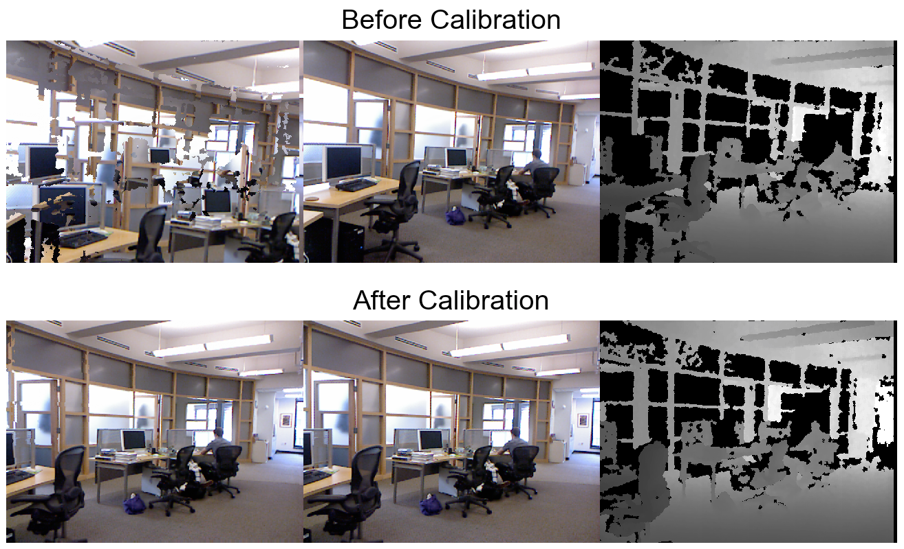

# illumiGrad

Automatically calibrate your RGBD cameras. The intrinsics and extrinsics of the camera pair are optimized based on photometric consistency after projecting the ToF camera into the color camera. I tested on semi-rectified color and Kinect continuous wave ToF cameras from the [NYU Depth V2 dataset](https://cs.nyu.edu/~silberman/datasets/nyu_depth_v2.html). Related work using photometric consistency as a loss signal: [LSD-SLAM](https://jakobengel.github.io/pdf/engel14eccv.pdf), [KinectFusion](https://www.microsoft.com/en-us/research/wp-content/uploads/2016/02/ismar2011.pdf), [CVPR 2017](https://arxiv.org/pdf/1704.07813.pdf), [ICCV 2019](https://arxiv.org/pdf/1806.01260.pdf), [ICCV 2021](https://arxiv.org/pdf/2108.13826.pdf).

<p align="center">
  
</p>

<p align="center">
  
</p>

<p align="center">
  
</p>


## Setting up color camera and ToF camera

1. I tested on semi-rectified color and ToF cameras in a stereo arrangement. This makes initialization much nicer because we can assume identity rotation. The translation and rotation vectors are updated during optimization, but there is a better chance of convergence if you tune the x component of the translation vector from the ToF camera to the color camera. I initialize the x component of the translation vector to 0.1.

2. There is a better chance of convergence if you initialize the focal lengths in a sensible range. The focal length fx = F * s, where F is your lens in mm and s is the unit-less horizontal resolution. Repeat for fy. F and s can be found either in the metadata of your image or can be easily looked up through the technical camera docs online. I tested with randomly initializing focal lengths between 400 and 600. I initialize the other intrinsic matrix parameters to 0.5.

In summary, get the cameras decently rectified and initialize the camera matrices sensibly close to ground truth. This will ensure better calibration performance. If optimization is failing early, revisit these steps first. 

## Dependencies
- PyTorch 1.10.2, used torch.linalg.pinv() which is only available in newer pytorch

## Calibrate

I only tested NYU Depth V2 and provide a short segment of it. I recommend using scenes with weak perspective and valid ToF pixels to calibrate since they optimized better from my experience (middle and bottom video from above). When there is strong perspective and less valid ToF pixels optimization struggled more (top video from above). Taking a varied video of a dynamic environment will potentially improve performance because it gives optimization a chance to get out of local minima. Optimization infrequently diverged after quality convergence even for long videos with varied scenes, so it seems that camera matrix initialization matters most and quality scene content initialization matters second for good final convergence. 

Calibrate with:

```shell
python main.py 
```

This image should appear after optimization is complete:




